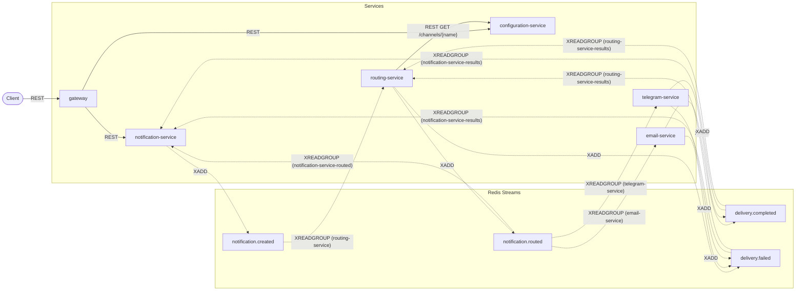

[English](README.md) | **Italiano**

# Piattaforma di notifica universale — Slice 2

## Cos'è

Una piattaforma a microservizi, eseguibile e **didattica**, che dimostra la coreografia
event-driven: l'Outbox Pattern, consumer idempotenti, la consegna "almeno una volta" (at-least-once)
e una saga basata su coreografia, senza un orchestratore centrale. Redis Streams è l'unico broker.
L'intera piattaforma gira in locale tramite Docker Compose. La leggibilità e il valore didattico
vengono prima dell'ampiezza delle funzionalità — ogni pattern di questo repository è documentato in
`docs/patterns.md` insieme al test che ne dimostra il funzionamento, e ogni correzione di design
rispetto al prompt originale è registrata come ADR in `docs/adr/`.

La slice 2 chiude l'unica lacuna che la slice 1 accettava — una notifica il cui consumer fallisce a
metà elaborazione resta bloccata lì per sempre — aggiungendo il recupero `XPENDING`/`XCLAIM`, la
resa dopo il numero massimo di tentativi e il watchdog per le elaborazioni bloccate (stale-processing).
Aggiunge inoltre il Telegram Service, l'API Gateway, la consegna reale opzionale su entrambi i canali
(SMTP generico per l'email, la Telegram Bot API), e trasforma il playground in una console di test
manuale con una pagina di test di carico simulato. Quello che resta per la slice 3: metriche e una
chiave API sul Gateway — vedi "Limiti noti" più sotto.

**Documentazione:** parti dall'[indice della documentazione](docs/README.it.md) — guida introduttiva,
guida al playground, configurazione, riferimento API e operatività, in inglese e italiano.

## Panoramica dell'architettura

Sei servizi FastAPI, ciascuno con il proprio database Postgres tranne il Gateway, che non ne
possiede alcuno. Nessun servizio legge il database di un altro servizio né chiama la REST API di un
altro servizio per un'operazione di dominio — ogni interazione tra servizi passa attraverso Redis
Streams. Le due eccezioni sono la chiamata REST sincrona di Routing Service a Configuration Service,
fatta una volta per ogni notifica che instrada, e l'inoltro REST sincrono del Gateway verso
notification-service e configuration-service, fatto una volta per ogni richiesta del client.



Un client invia una `POST` al Gateway e poi lo interroga in polling; il Gateway inoltra a
Notification Service, che pubblica un fatto (`NotificationCreated`) invece di chiamare qualcuno.
Routing Service reagisce a quel fatto, verifica Configuration Service, e pubblica un proprio fatto
(`NotificationRouted` o `RoutingFailed`). Email Service e Telegram Service reagiscono ciascuno a una
notifica instradata verso il proprio canale e pubblicano un esito di consegna. Ognuno di questi
servizi consuma inoltre in modo indipendente gli esiti che lo riguardano, per chiudere il proprio
record. Nessun componente dice a un altro cosa fare; ognuno reagisce a ciò che è già accaduto. Vedi
`docs/architecture.md` per l'analisi completa, incluso il costo di questa scelta, e
`docs/event-flows.md` per i diagrammi di sequenza di ogni esito della saga, compresa la resa dopo il
numero massimo di tentativi.

## Avvio rapido

```bash
docker compose up --build -d --wait
```

Questo comando compila e avvia tutti e dodici i container (sei servizi, cinque database Postgres,
Redis) e attende che ogni healthcheck vada a buon fine.

Invia una notifica, attraverso il Gateway:

```bash
curl -s -X POST http://localhost:8000/api/v1/notifications \
  -H 'Content-Type: application/json' \
  -d '{"channel": "email", "recipient": "john@example.com", "subject": "Welcome", "body": "Hello John!"}'
```

```json
{"notification_id": "3f2a1e4c-...", "status": "CREATED"}
```

Interrogala con il polling finché non arriva allo stato finale:

```bash
curl -s http://localhost:8000/api/v1/notifications/3f2a1e4c-...
```

```json
{"notification_id": "3f2a1e4c-...", "channel": "email", "status": "PROCESSING", "fail_reason": null, "created_at": "...", "updated_at": "..."}
```

Un momento dopo:

```json
{"notification_id": "3f2a1e4c-...", "channel": "email", "status": "COMPLETED", "fail_reason": null, "created_at": "...", "updated_at": "..."}
```

## Consegna reale

Entrambi i canali sono simulati per impostazione predefinita. Per inviare realmente:

```bash
cp .env.example .env
# fill in TELEGRAM_BOT_TOKEN and/or the SMTP_* values
docker compose up -d
```

Il `recipient` di una notifica Telegram **è** il chat id — non esiste una variabile separata per il
chat id (ADR 0026). Qualunque cosa tu configuri, due regole mantengono ogni percorso automatizzato
(gli esempi del README, i test e2e, il test di carico) sicuro e deterministico:

- Un destinatario che contiene `fail` (senza distinguere maiuscole/minuscole) fallisce sempre, in
  modo deterministico, prima di qualunque chiamata di rete.
- Un destinatario **riservato** — un'email su `example.com`/`example.org`/`example.net` o su un
  qualunque dominio sotto i top-level domain `.example`/`.invalid`/`.test` (RFC 2606), oppure un
  chat id Telegram che inizia con `sim-` — viene sempre consegnato dal sender simulato, qualunque
  sia la configurazione (ADR 0030).

Il playground mostra la modalità configurata di ciascun canale (il `delivery_mode` di `GET
/version`) e chiede una conferma esplicita prima di inviare realmente a un destinatario non
riservato.

## Topologia degli stream

| Stream | Publisher | Consumer group | Comportamento |
|---|---|---|---|
| `notification.created` | notification-service | `routing-service` | Decide dove instradare la notifica |
| `notification.routed` | routing-service | `email-service` | Filtra `payload.channel == "email"`, consegna |
| | | `telegram-service` | Filtra `payload.channel == "telegram"`, consegna |
| | | `notification-service-routed` | Imposta `notifications.status = 'PROCESSING'` |
| `delivery.completed` | email-service, telegram-service | `notification-service-results` | Imposta `notifications.status = 'COMPLETED'` |
| | | `routing-service-results` | Imposta `routes.status = 'COMPLETED'` |
| `delivery.failed` | routing-service, email-service, telegram-service | `notification-service-results` | Imposta `notifications.status = 'FAILED'` + motivo |
| | | `routing-service-results` | Ignora il proprio `RoutingFailed` |

Schemi completi dei payload e diagrammi di sequenza: `docs/event-flows.md`.

## Guida al polling

Il caso di successo: `CREATED → PROCESSING → COMPLETED`.

```bash
curl -s -X POST http://localhost:8000/api/v1/notifications \
  -H 'Content-Type: application/json' \
  -d '{"channel": "email", "recipient": "john@example.com", "body": "Hello"}'
# -> {"notification_id": "<id>", "status": "CREATED"}

curl -s http://localhost:8000/api/v1/notifications/<id>
# -> status: CREATED, then PROCESSING, then COMPLETED as you poll again
```

**Percorso di fallimento 1 — disabilita prima il canale**, così il routing stesso fallisce e la
notifica segue direttamente il percorso `CREATED → FAILED` (senza `PROCESSING` in mezzo):

```bash
curl -s -X PUT http://localhost:8000/api/v1/channels/email -H 'Content-Type: application/json' -d '{"enabled": false}'

curl -s -X POST http://localhost:8000/api/v1/notifications \
  -H 'Content-Type: application/json' \
  -d '{"channel": "email", "recipient": "john@example.com", "body": "Hello"}'

curl -s http://localhost:8000/api/v1/notifications/<id>
# -> {"status": "FAILED", "fail_reason": "channel_disabled", ...}
```

Riabilitalo poi con: `curl -s -X PUT http://localhost:8000/api/v1/channels/email -H 'Content-Type: application/json' -d '{"enabled": true}'`

**Percorso di fallimento 2 — un destinatario con `fail`**, così il routing riesce ma è la consegna a
fallire, passando per `CREATED → PROCESSING → FAILED`:

```bash
curl -s -X POST http://localhost:8000/api/v1/notifications \
  -H 'Content-Type: application/json' \
  -d '{"channel": "email", "recipient": "fail@example.com", "body": "Hello"}'

curl -s http://localhost:8000/api/v1/notifications/<id>
# -> {"status": "FAILED", "fail_reason": "simulated_failure", ...}
```

**Caso di successo per Telegram**, un chat id riservato così resta simulato:

```bash
curl -s -X POST http://localhost:8000/api/v1/notifications \
  -H 'Content-Type: application/json' \
  -d '{"channel": "telegram", "recipient": "sim-demo", "body": "Hello"}'

curl -s http://localhost:8000/api/v1/notifications/<id>
# -> status: CREATED, then PROCESSING, then COMPLETED as you poll again
```

**Recupero**, fermando e riavviando una dipendenza a metà elaborazione:

```bash
docker compose stop configuration-service

curl -s -X POST http://localhost:8000/api/v1/notifications \
  -H 'Content-Type: application/json' \
  -d '{"channel": "email", "recipient": "john@example.com", "body": "Hello"}'
# -> {"notification_id": "<id>", "status": "CREATED"}
# stays CREATED: routing-service cannot reach configuration-service

docker compose start configuration-service

curl -s http://localhost:8000/api/v1/notifications/<id>
# -> watch it reach COMPLETED within about 40s, once recovery claims and retries the entry
```

## Configurazione

Ogni variabile qui sotto è impostata in `docker-compose.yml` ed è modificabile lì (oppure, per i
segreti, in un `.env` locale — vedi "Consegna reale" più sopra).

| Variabile | Predefinito | Si applica a | Letta nella slice 2 |
|---|---|---|---|
| `DATABASE_URL` | — | tutti tranne il gateway | Sì |
| `REDIS_URL` | `redis://redis:6379/0` | tutti i servizi event-driven | Sì |
| `SERVICE_NAME` | per servizio | tutti | Sì |
| `SERVICE_VERSION` | `1.0.0` | tutti | Sì |
| `LOG_LEVEL` | `INFO` | tutti | Sì |
| `CONSUMER_POLL_INTERVAL_MS` | `500` | servizi event-driven | Sì |
| `OUTBOX_POLL_INTERVAL_MS` | `500` | servizi con un outbox | Sì |
| `OUTBOX_BATCH_SIZE` | `100` | servizi con un outbox | Sì |
| `PENDING_TIMEOUT_MS` | `30000` | routing, email, telegram, notification | Sì |
| `PENDING_MAX_RETRIES` | `3` | routing, email, telegram, notification | Sì |
| `RECOVERY_POLL_INTERVAL_MS` | `5000` | routing, email, telegram, notification | Sì |
| `PROCESSING_TIMEOUT_MINUTES` | `5` | notification-service | Sì |
| `WATCHDOG_INTERVAL_SECONDS` | `60` | notification-service | Sì |
| `CONFIGURATION_SERVICE_URL` | `http://configuration-service:8000` | routing-service, gateway | Sì |
| `HTTP_TIMEOUT_SECONDS` | `5.0` | routing, telegram, email (timeout per ogni operazione SMTP) | Sì |
| `GATEWAY_TIMEOUT_SECONDS` | `10.0` | gateway | Sì |
| `NOTIFICATION_SERVICE_URL` | `http://notification-service:8000` | gateway | Sì |
| `DELIVERY_LATENCY_MS_MAX` | `500` | email, telegram (sender simulato) | Sì |
| `TELEGRAM_BOT_TOKEN` | non impostato | telegram-service | Sì |
| `SMTP_HOST` | non impostato | email-service | Sì |
| `SMTP_PORT` | `587` | email-service | Sì |
| `SMTP_USERNAME` | non impostato | email-service | Sì |
| `SMTP_PASSWORD` | non impostato | email-service | Sì |
| `SMTP_FROM` | non impostato | email-service; obbligatoria quando `SMTP_HOST` è impostata | Sì |
| `SMTP_SECURITY` | `starttls` | email-service; `starttls`, `ssl` o `none` | Sì |
| `GATEWAY_URL` | `http://localhost:8000` | playground, test e2e | Sì |
| `NOTIFICATION_URL` | `http://localhost:8001` | playground, test e2e | Sì |
| `ROUTING_URL` | `http://localhost:8002` | playground, test e2e | Sì |
| `CONFIGURATION_URL` | `http://localhost:8003` | playground, test e2e | Sì |
| `EMAIL_URL` | `http://localhost:8004` | playground, test e2e | Sì |
| `TELEGRAM_URL` | `http://localhost:8005` | playground, test e2e | Sì |

`TELEGRAM_CHAT_ID` del design della slice 1 è **stata rimossa**: il `recipient` della notifica è il
chat id (ADR 0026).

## Installazione locale con uv

```bash
uv venv
uv sync --all-packages --group playground
```

produce un unico `.venv` alla radice per l'intero workspace, inclusi il Gateway e il gruppo di
dipendenze proprio del playground. `uv pip install` **non** funziona con la versione di `uv` installata (la
0.11.7 lo rifiuta) — usa solo `uv add`, `uv sync` e `uv run`. Vedi `docs/local-development.md` per
il debug in VS Code, le migrazioni e il reset.

## Eseguire i test

```bash
uv run pytest tests/unit
uv run pytest tests/integration
PYTHONPATH=services/configuration-service uv run pytest services/configuration-service/tests
PYTHONPATH=services/notification-service  uv run pytest services/notification-service/tests
PYTHONPATH=services/routing-service       uv run pytest services/routing-service/tests
PYTHONPATH=services/email-service         uv run pytest services/email-service/tests
PYTHONPATH=services/telegram-service      uv run pytest services/telegram-service/tests
PYTHONPATH=gateway                        uv run pytest gateway/tests
PYTHONPATH=tools/playground uv run --group playground pytest tools/playground/tests
```

I primi due, e ogni suite di servizio, richiedono Docker in esecuzione (Postgres e Redis reali
tramite testcontainers); la suite del gateway non richiede Docker. I test end-to-end (`uv run
pytest tests/e2e`) richiedono lo stack completo già avviato tramite `docker compose up --build -d
--wait`.

## Limiti noti

Ereditati dalla slice 1 e ancora validi: nessuno schema registry, nessuna dead-letter queue (un
evento per cui ci si è arresi viene registrato in `processed_events` e scartato dallo stream),
nessun backend di distributed tracing, nessun circuit breaker sulla chiamata REST Routing →
Configuration, nessuna scalabilità orizzontale dei consumer — un'istanza per servizio, un consumer
per gruppo — e consegna "almeno una volta", non esattamente una volta.

Non più vero: "Niente SMTP reale."

Novità nella slice 2:

- **Latenza di recupero.** Un fallimento transitorio viene riprovato solo dopo `PENDING_TIMEOUT_MS`
  di inattività; la resa richiede circa due minuti con i valori predefiniti.
- **Il watchdog lascia la riga `routes` di Routing Service a `PROCESSING`**, e può marcare come
  `FAILED` una notifica la cui consegna riesce in seguito, perché gli stati terminali non si
  riaprono mai (ADR 0028).
- **I nomi dei consumer morti si accumulano** nell'elenco `XINFO CONSUMERS` di ogni gruppo.
  Innocuo; non viene ripulito.
- **La consegna "almeno una volta" ha ora un costo visibile.** Un crash dopo un invio reale ma
  prima del commit invia due volte l'email o il messaggio Telegram; lo stesso vale per un timeout
  dopo che il server ha già accettato il messaggio ma prima che il client abbia visto la risposta
  (una risposta finale SMTP, un timeout di lettura della Bot API). L'idempotenza protegge il
  database, non la casella di posta del destinatario.
- **La consegna reale via SMTP e Bot API non è messa alla prova da nessun test automatico** — è coperta
  dalle suite fake-server e `MockTransport`, e dall'uso manuale tramite il playground.
- **Il throughput del test di carico è limitato da un consumer per gruppo e dalla latenza di
  consegna simulata**; misura la piattaforma così com'è configurata a scopo didattico, non il suo
  limite massimo.
- **I test di carico ampi sullo stack compose a un consumer fanno scattare il watchdog**: oltre circa
  450 notifiche il backlog di consegna supera `PROCESSING_TIMEOUT_MINUTES`, quindi il watchdog fa
  fallire le notifiche ancora in coda con `processing_timeout` (ADR 0028) invece di completarle.

Ancora da fare nella slice 3: una chiave API sul Gateway, metriche Prometheus.
