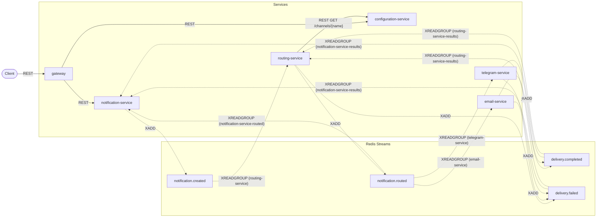

**English** | [Italiano](README.it.md)

# Universal Notification Platform — Slice 2

## What this is

A runnable, **educational** microservices platform that demonstrates event-driven choreography:
the Outbox Pattern, idempotent consumers, at-least-once delivery, and a choreography-based saga
with no central orchestrator. Redis Streams is the only broker. The whole platform runs locally
via Docker Compose. Readability and educational value take priority over feature breadth — every
pattern in this repository is documented in `docs/patterns.md` alongside the test that proves it
works, and every design correction from the original prompt is recorded as an ADR under
`docs/adr/`.

Slice 2 closes the one gap slice 1 accepted — a notification whose consumer fails mid-flight stays
where it is forever — by adding `XPENDING`/`XCLAIM` recovery, max-retry give-up, and the
stale-processing watchdog. It also adds Telegram Service, the API Gateway, optional real delivery
on both channels (generic SMTP for email, the Telegram Bot API), and reworks the playground into a
manual test console with a simulated load test page. What remains for slice 3: metrics and an API
key on the Gateway — see "Known limitations" below.

**Documentation:** start from the [documentation index](docs/README.md) — getting started, the
playground guide, configuration, API reference and operations, in English and Italian.

## Architecture overview

Six FastAPI services, each owning its own Postgres database except the Gateway, which owns nothing.
No service reads another service's database or calls another service's REST API for a domain
operation — all cross-service interaction flows through Redis Streams. The two exceptions are
Routing Service's synchronous REST call to Configuration Service, made once per notification it
routes, and the Gateway's synchronous REST forwarding to notification-service and
configuration-service, made once per client request.



A client `POST`s to the Gateway and polls it; the Gateway forwards to Notification Service, which
publishes a fact (`NotificationCreated`) rather than calling anyone. Routing Service reacts to that
fact, checks Configuration Service, and publishes its own fact (`NotificationRouted` or
`RoutingFailed`). Email Service and Telegram Service each react to a routed notification addressed
to their own channel and publish a delivery outcome. Every one of those services also independently
consumes the outcomes relevant to it, to close out its own record. No component tells another what
to do; each reacts to what has already happened. See `docs/architecture.md` for the full breakdown,
including the cost of this choice, and `docs/event-flows.md` for the sequence diagrams of every
saga outcome, including give-up after max retries.

## Quick start

```bash
docker compose up --build -d --wait
```

This builds and starts all twelve containers (six services, five Postgres databases, Redis) and
waits for every healthcheck to pass.

Submit a notification, through the Gateway:

```bash
curl -s -X POST http://localhost:8000/api/v1/notifications \
  -H 'Content-Type: application/json' \
  -d '{"channel": "email", "recipient": "john@example.com", "subject": "Welcome", "body": "Hello John!"}'
```

```json
{"notification_id": "3f2a1e4c-...", "status": "CREATED"}
```

Poll it until it settles:

```bash
curl -s http://localhost:8000/api/v1/notifications/3f2a1e4c-...
```

```json
{"notification_id": "3f2a1e4c-...", "channel": "email", "status": "PROCESSING", "fail_reason": null, "created_at": "...", "updated_at": "..."}
```

A moment later:

```json
{"notification_id": "3f2a1e4c-...", "channel": "email", "status": "COMPLETED", "fail_reason": null, "created_at": "...", "updated_at": "..."}
```

## Real delivery

Both channels are simulated by default. To send for real:

```bash
cp .env.example .env
# fill in TELEGRAM_BOT_TOKEN and/or the SMTP_* values
docker compose up -d
```

A Telegram notification's `recipient` **is** the chat id — there is no separate chat id variable
(ADR 0026). Whatever you configure, two rules keep every automated path (README examples, e2e
tests, the load test) safe and deterministic:

- A recipient containing `fail` (case insensitive) always fails, deterministically, before any
  network call.
- A **reserved** recipient — email at `example.com`/`example.org`/`example.net` or any domain under
  the top-level domains `.example`/`.invalid`/`.test` (RFC 2606), or a Telegram chat id starting
  with `sim-` — is always delivered by the simulated sender, whatever is configured (ADR 0030).

The playground shows each channel's configured mode (`GET /version`'s `delivery_mode`) and asks for
an explicit confirmation before submitting a real send to a non-reserved recipient.

## Stream topology

| Stream | Publishers | Consumer group | Behaviour |
|---|---|---|---|
| `notification.created` | notification-service | `routing-service` | Decides where the notification is routed |
| `notification.routed` | routing-service | `email-service` | Filters `payload.channel == "email"`, delivers |
| | | `telegram-service` | Filters `payload.channel == "telegram"`, delivers |
| | | `notification-service-routed` | Sets `notifications.status = 'PROCESSING'` |
| `delivery.completed` | email-service, telegram-service | `notification-service-results` | Sets `notifications.status = 'COMPLETED'` |
| | | `routing-service-results` | Sets `routes.status = 'COMPLETED'` |
| `delivery.failed` | routing-service, email-service, telegram-service | `notification-service-results` | Sets `notifications.status = 'FAILED'` + reason |
| | | `routing-service-results` | Skips its own `RoutingFailed` |

Full payload schemas and sequence diagrams: `docs/event-flows.md`.

## Polling guide

The happy path: `CREATED → PROCESSING → COMPLETED`.

```bash
curl -s -X POST http://localhost:8000/api/v1/notifications \
  -H 'Content-Type: application/json' \
  -d '{"channel": "email", "recipient": "john@example.com", "body": "Hello"}'
# -> {"notification_id": "<id>", "status": "CREATED"}

curl -s http://localhost:8000/api/v1/notifications/<id>
# -> status: CREATED, then PROCESSING, then COMPLETED as you poll again
```

**Failure path 1 — disable the channel first**, so routing itself fails and the notification goes
`CREATED → FAILED` directly (no `PROCESSING` in between):

```bash
curl -s -X PUT http://localhost:8000/api/v1/channels/email -H 'Content-Type: application/json' -d '{"enabled": false}'

curl -s -X POST http://localhost:8000/api/v1/notifications \
  -H 'Content-Type: application/json' \
  -d '{"channel": "email", "recipient": "john@example.com", "body": "Hello"}'

curl -s http://localhost:8000/api/v1/notifications/<id>
# -> {"status": "FAILED", "fail_reason": "channel_disabled", ...}
```

Re-enable it afterward: `curl -s -X PUT http://localhost:8000/api/v1/channels/email -H 'Content-Type: application/json' -d '{"enabled": true}'`

**Failure path 2 — a `fail` recipient**, so routing succeeds and delivery itself fails, going
`CREATED → PROCESSING → FAILED`:

```bash
curl -s -X POST http://localhost:8000/api/v1/notifications \
  -H 'Content-Type: application/json' \
  -d '{"channel": "email", "recipient": "fail@example.com", "body": "Hello"}'

curl -s http://localhost:8000/api/v1/notifications/<id>
# -> {"status": "FAILED", "fail_reason": "simulated_failure", ...}
```

**Telegram happy path**, a reserved chat id so it stays simulated:

```bash
curl -s -X POST http://localhost:8000/api/v1/notifications \
  -H 'Content-Type: application/json' \
  -d '{"channel": "telegram", "recipient": "sim-demo", "body": "Hello"}'

curl -s http://localhost:8000/api/v1/notifications/<id>
# -> status: CREATED, then PROCESSING, then COMPLETED as you poll again
```

**Recovery**, stopping and restarting a dependency mid-flight:

```bash
docker compose stop configuration-service

curl -s -X POST http://localhost:8000/api/v1/notifications \
  -H 'Content-Type: application/json' \
  -d '{"channel": "email", "recipient": "john@example.com", "body": "Hello"}'
# -> {"notification_id": "<id>", "status": "CREATED"}
# stays CREATED: routing-service cannot reach configuration-service

docker compose start configuration-service

curl -s http://localhost:8000/api/v1/notifications/<id>
# -> watch it reach COMPLETED within about 40s, once recovery claims and retries the entry
```

## Configuration

Every variable below is set in `docker-compose.yml` and overridable there (or, for the secrets, in
a local `.env` — see "Real delivery" above).

| Variable | Default | Applies to | Reads in slice 2 |
|---|---|---|---|
| `DATABASE_URL` | — | all except gateway | Yes |
| `REDIS_URL` | `redis://redis:6379/0` | all event-driven services | Yes |
| `SERVICE_NAME` | per service | all | Yes |
| `SERVICE_VERSION` | `1.0.0` | all | Yes |
| `LOG_LEVEL` | `INFO` | all | Yes |
| `CONSUMER_POLL_INTERVAL_MS` | `500` | event-driven services | Yes |
| `OUTBOX_POLL_INTERVAL_MS` | `500` | services with an outbox | Yes |
| `OUTBOX_BATCH_SIZE` | `100` | services with an outbox | Yes |
| `PENDING_TIMEOUT_MS` | `30000` | routing, email, telegram, notification | Yes |
| `PENDING_MAX_RETRIES` | `3` | routing, email, telegram, notification | Yes |
| `RECOVERY_POLL_INTERVAL_MS` | `5000` | routing, email, telegram, notification | Yes |
| `PROCESSING_TIMEOUT_MINUTES` | `5` | notification-service | Yes |
| `WATCHDOG_INTERVAL_SECONDS` | `60` | notification-service | Yes |
| `CONFIGURATION_SERVICE_URL` | `http://configuration-service:8000` | routing-service, gateway | Yes |
| `HTTP_TIMEOUT_SECONDS` | `5.0` | routing, telegram, email (timeout for every SMTP operation) | Yes |
| `GATEWAY_TIMEOUT_SECONDS` | `10.0` | gateway | Yes |
| `NOTIFICATION_SERVICE_URL` | `http://notification-service:8000` | gateway | Yes |
| `DELIVERY_LATENCY_MS_MAX` | `500` | email, telegram (simulated sender) | Yes |
| `TELEGRAM_BOT_TOKEN` | unset | telegram-service | Yes |
| `SMTP_HOST` | unset | email-service | Yes |
| `SMTP_PORT` | `587` | email-service | Yes |
| `SMTP_USERNAME` | unset | email-service | Yes |
| `SMTP_PASSWORD` | unset | email-service | Yes |
| `SMTP_FROM` | unset | email-service; required when `SMTP_HOST` is set | Yes |
| `SMTP_SECURITY` | `starttls` | email-service; `starttls`, `ssl`, or `none` | Yes |
| `GATEWAY_URL` | `http://localhost:8000` | playground, e2e tests | Yes |
| `NOTIFICATION_URL` | `http://localhost:8001` | playground, e2e tests | Yes |
| `ROUTING_URL` | `http://localhost:8002` | playground, e2e tests | Yes |
| `CONFIGURATION_URL` | `http://localhost:8003` | playground, e2e tests | Yes |
| `EMAIL_URL` | `http://localhost:8004` | playground, e2e tests | Yes |
| `TELEGRAM_URL` | `http://localhost:8005` | playground, e2e tests | Yes |

`TELEGRAM_CHAT_ID` from the slice 1 design is **removed**: the notification's `recipient` is the
chat id (ADR 0026).

## Local setup with uv

```bash
uv venv
uv sync --all-packages --group playground
```

produces one root `.venv` for the whole workspace, including the Gateway and the playground's own
dependency group. `uv pip install` does **not** work with the installed `uv` (0.11.7 rejects it) —
use `uv add`, `uv sync`, and `uv run` only. See `docs/local-development.md` for VS Code debugging,
migrations, and resetting.

## Running the tests

```bash
uv run pytest tests/unit
uv run pytest tests/integration
PYTHONPATH=services/configuration-service uv run pytest services/configuration-service/tests
PYTHONPATH=services/notification-service  uv run pytest services/notification-service/tests
PYTHONPATH=services/routing-service       uv run pytest services/routing-service/tests
PYTHONPATH=services/email-service         uv run pytest services/email-service/tests
PYTHONPATH=services/telegram-service      uv run pytest services/telegram-service/tests
PYTHONPATH=gateway                        uv run pytest gateway/tests
PYTHONPATH=tools/playground uv run --group playground pytest tools/playground/tests
```

The first two, and every service suite, need Docker running (real Postgres and Redis via
testcontainers); the gateway suite does not need Docker. End-to-end tests (`uv run pytest
tests/e2e`) need the full stack already up via `docker compose up --build -d --wait`.

## Known limitations

Carried from slice 1 and still true: no schema registry, no dead-letter queue (a given-up event is
recorded in `processed_events` and discarded from the stream), no distributed tracing backend, no
circuit breaker on the Routing → Configuration REST call, no horizontal scaling of consumers — one
instance per service, one consumer per group — and at-least-once delivery, not exactly-once.

No longer true: "No real SMTP."

New in slice 2:

- **Recovery latency.** A transient failure is retried only after `PENDING_TIMEOUT_MS` of idleness;
  give-up takes about two minutes with the defaults.
- **The watchdog leaves Routing Service's `routes` row at `PROCESSING`**, and can mark a
  notification `FAILED` whose delivery later succeeds, because terminal states never reopen (ADR
  0028).
- **Dead consumer names accumulate** in each group's `XINFO CONSUMERS` listing. Harmless; not
  cleaned up.
- **At-least-once delivery now has a visible cost.** A crash after a real send but before the commit
  sends the email or Telegram message twice; so does a timeout after the server already accepted
  the message but before the client saw the reply (an SMTP final reply, a Bot API read timeout).
  Idempotency protects the database, not the recipient's inbox.
- **Real SMTP and Bot API delivery are not exercised by any automated test** — they are covered by
  fake-server and `MockTransport` suites, and by manual use through the playground.
- **Load test throughput is bounded by one consumer per group and the simulated delivery latency**;
  it measures the platform as configured for teaching, not its ceiling.
- **Large load tests on the one-consumer compose stack hit the watchdog**: past roughly 450
  notifications the delivery backlog exceeds `PROCESSING_TIMEOUT_MINUTES`, so the watchdog fails
  queued notifications with `processing_timeout` (ADR 0028) instead of completing them.

Still to come in slice 3: an API key on the Gateway, Prometheus metrics.
