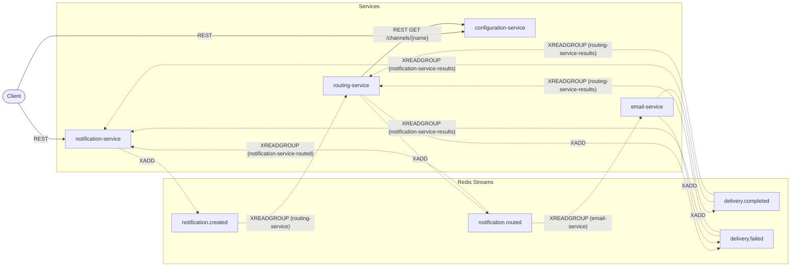

# Universal Notification Platform — Slice 1

## What this is

A runnable, **educational** microservices platform that demonstrates event-driven choreography:
the Outbox Pattern, idempotent consumers, at-least-once delivery, and a choreography-based saga
with no central orchestrator. Redis Streams is the only broker. The whole platform runs locally
via Docker Compose. Readability and educational value take priority over feature breadth — every
pattern in this repository is documented in `docs/patterns.md` alongside the test that proves it
works, and every design correction from the original prompt is recorded as an ADR under
`docs/adr/`.

This is slice 1 of three: the saga in both its happy-path and both failure outcomes, across four
services (Notification, Routing, Configuration, Email). Telegram Service, an API Gateway, and
crash recovery are slice 2 — see "Known limitations" below.

## Architecture overview

Four FastAPI services, each owning its own Postgres database. No service reads another service's
database or calls another service's REST API for a domain operation — all cross-service
interaction flows through Redis Streams. The one exception is Routing Service's synchronous REST
call to Configuration Service, made once per notification it routes.



A client `POST`s to Notification Service and polls it; Notification Service publishes a fact
(`NotificationCreated`) rather than calling anyone. Routing Service reacts to that fact, checks
Configuration Service, and publishes its own fact (`NotificationRouted` or `RoutingFailed`). Email
Service reacts to a routed notification addressed to it and publishes a delivery outcome. Every one
of those services also independently consumes the outcomes relevant to it, to close out its own
record. No component tells another what to do; each reacts to what has already happened. See
`docs/architecture.md` for the full breakdown, including the cost of this choice, and
`docs/event-flows.md` for the sequence diagrams of all three saga outcomes.

## Quick start

```bash
docker compose up --build -d --wait
```

This builds and starts all nine containers (four services, four Postgres databases, Redis) and
waits for every healthcheck to pass.

Submit a notification:

```bash
curl -s -X POST http://localhost:8001/notifications \
  -H 'Content-Type: application/json' \
  -d '{"channel": "email", "recipient": "john@example.com", "subject": "Welcome", "body": "Hello John!"}'
```

```json
{"notification_id": "3f2a1e4c-...", "status": "CREATED"}
```

Poll it until it settles:

```bash
curl -s http://localhost:8001/notifications/3f2a1e4c-...
```

```json
{"notification_id": "3f2a1e4c-...", "channel": "email", "status": "PROCESSING", "fail_reason": null, "created_at": "...", "updated_at": "..."}
```

A moment later:

```json
{"notification_id": "3f2a1e4c-...", "channel": "email", "status": "COMPLETED", "fail_reason": null, "created_at": "...", "updated_at": "..."}
```

## Stream topology

| Stream | Publishers | Consumer group | Behaviour |
|---|---|---|---|
| `notification.created` | notification-service | `routing-service` | Decides where the notification is routed |
| `notification.routed` | routing-service | `email-service` | Filters `payload.channel == "email"`, delivers |
| | | `telegram-service` | Declared, no consumer yet (slice 2); filters `"telegram"` |
| | | `notification-service-routed` | Sets `notifications.status = 'PROCESSING'` |
| `delivery.completed` | email-service | `notification-service-results` | Sets `notifications.status = 'COMPLETED'` |
| | | `routing-service-results` | Sets `routes.status = 'COMPLETED'` |
| `delivery.failed` | routing-service, email-service | `notification-service-results` | Sets `notifications.status = 'FAILED'` + reason |
| | | `routing-service-results` | Skips its own `RoutingFailed` |

Full payload schemas and sequence diagrams: `docs/event-flows.md`.

## Polling guide

The happy path: `CREATED → PROCESSING → COMPLETED`.

```bash
curl -s -X POST http://localhost:8001/notifications \
  -H 'Content-Type: application/json' \
  -d '{"channel": "email", "recipient": "john@example.com", "body": "Hello"}'
# -> {"notification_id": "<id>", "status": "CREATED"}

curl -s http://localhost:8001/notifications/<id>
# -> status: CREATED, then PROCESSING, then COMPLETED as you poll again
```

**Failure path 1 — disable the channel first**, so routing itself fails and the notification goes
`CREATED → FAILED` directly (no `PROCESSING` in between):

```bash
curl -s -X PUT http://localhost:8003/channels/email -H 'Content-Type: application/json' -d '{"enabled": false}'

curl -s -X POST http://localhost:8001/notifications \
  -H 'Content-Type: application/json' \
  -d '{"channel": "email", "recipient": "john@example.com", "body": "Hello"}'

curl -s http://localhost:8001/notifications/<id>
# -> {"status": "FAILED", "fail_reason": "channel_disabled", ...}
```

Re-enable it afterward: `curl -s -X PUT http://localhost:8003/channels/email -H 'Content-Type: application/json' -d '{"enabled": true}'`

**Failure path 2 — a `fail` recipient**, so routing succeeds and delivery itself fails, going
`CREATED → PROCESSING → FAILED`:

```bash
curl -s -X POST http://localhost:8001/notifications \
  -H 'Content-Type: application/json' \
  -d '{"channel": "email", "recipient": "fail@example.com", "body": "Hello"}'

curl -s http://localhost:8001/notifications/<id>
# -> {"status": "FAILED", "fail_reason": "simulated_failure", ...}
```

## Configuration

Every variable below is set in `docker-compose.yml` and overridable there. "Reads in slice 1"
marks whether the variable is actually consumed by slice-1 code today, independent of what the
full platform's design eventually needs.

| Variable | Default | Applies to | Reads in slice 1 |
|---|---|---|---|
| `DATABASE_URL` | — | all except gateway | Yes (notification, routing, configuration, email) |
| `REDIS_URL` | `redis://redis:6379/0` | all event-driven services | Yes (notification, routing, email) |
| `SERVICE_NAME` | per service | all | Yes |
| `SERVICE_VERSION` | `1.0.0` | all | Yes |
| `LOG_LEVEL` | `INFO` | all | Yes |
| `CONSUMER_POLL_INTERVAL_MS` | `500` | event-driven services | Yes (notification, routing, email) |
| `OUTBOX_POLL_INTERVAL_MS` | `500` | services with an outbox | Yes (notification, routing, email) |
| `OUTBOX_BATCH_SIZE` | `100` | services with an outbox | Yes (notification, routing, email) |
| `PENDING_TIMEOUT_MS` | `30000` | slice 2 | No |
| `PENDING_MAX_RETRIES` | `3` | slice 2 | No |
| `PROCESSING_TIMEOUT_MINUTES` | `5` | notification-service, slice 2 | No |
| `CONFIGURATION_SERVICE_URL` | — | routing-service | Yes |
| `HTTP_TIMEOUT_SECONDS` | `5.0` | routing-service, gateway | Yes (routing-service only; no gateway in slice 1) |
| `GATEWAY_TIMEOUT_SECONDS` | `10.0` | gateway, slice 2 | No |
| `TELEGRAM_BOT_TOKEN` | unset | telegram-service, slice 2 | No |
| `TELEGRAM_CHAT_ID` | unset | telegram-service, slice 2 | No |

Email Service also reads `DELIVERY_LATENCY_MS_MAX` (default `500`), the upper bound in
milliseconds of its simulated random delivery delay — not part of the platform-wide table above
because it applies only to Email Service.

## Local setup with uv

```bash
uv venv
uv sync --all-packages
```

produces one root `.venv` for the whole workspace. `uv pip install` does **not** work with the
installed `uv` (0.11.7 rejects it) — use `uv add`, `uv sync`, and `uv run` only. See
`docs/local-development.md` for VS Code debugging, migrations, and resetting.

## Running the tests

```bash
uv run pytest tests/unit
uv run pytest tests/integration
PYTHONPATH=services/configuration-service uv run pytest services/configuration-service/tests
PYTHONPATH=services/notification-service  uv run pytest services/notification-service/tests
PYTHONPATH=services/routing-service       uv run pytest services/routing-service/tests
PYTHONPATH=services/email-service         uv run pytest services/email-service/tests
```

The first two need Docker running (real Postgres and Redis via testcontainers); the four service
suites too. End-to-end tests (`uv run pytest tests/e2e`) need the full stack already up via
`docker compose up --build -d --wait`.

## Known limitations

Carried over from the original design, unchanged:

- No schema registry — events are versioned by convention, not enforced
- No dead-letter queue — max-retry via `processed_events`, then discard (slice 2)
- No distributed tracing backend — correlation ID in logs only, no OpenTelemetry spans
- No circuit breaker on the Routing → Configuration REST call
- No horizontal scaling of consumers — one instance per service, one consumer per group
- At-least-once delivery, not exactly-once; idempotency mitigates duplicate effects
- Simulated delivery for Email; Telegram is real only when its environment variables are set (slice 2)
- No real SMTP

Added for slice 1:

- **Slice 1 has no recovery worker and no watchdog.** `XPENDING`/`XCLAIM` recovery, max-retry
  handling, and the stale-processing watchdog are all slice 2. A notification whose consumer
  crashes mid-flight — after reading a message but before its handling transaction commits and
  acks — stays in its current state indefinitely. Nothing in slice 1 will ever revisit it.
- **Postgres and Redis state are coupled.** Consumer groups start at offset `0`, so a group
  re-created against a database that was reset without also resetting Redis replays that stream's
  entire history against empty tables. Volumes must be reset together: `docker compose down -v`,
  never one store alone.
