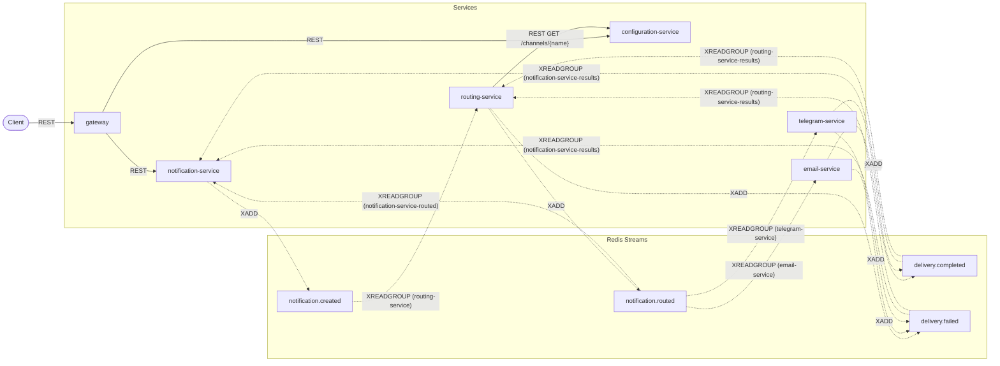

[English](architecture.md) | **Italiano**

# Architettura

La slice 2 della Piattaforma di notifica universale: sei servizi, un'istanza Redis e un database Postgres
per servizio a eccezione del Gateway, che non ne possiede nessuno, collegati interamente tramite
Redis Streams. Questo documento descrive cosa la slice 2 ha costruito, sopra i quattro servizi della
slice 1.

## Servizi e confini

| Servizio | Possiede | Database | Superficie HTTP |
|---|---|---|---|
| notification-service | L'aggregato notifica: cosa è stato richiesto e il suo stato attuale | `notificationdb` | `POST /notifications`, `GET /notifications/{id}`, `GET /notifications`, oltre a `/health`, `/version`, `/docs`, `/redoc` |
| routing-service | La decisione di instradamento per ogni notifica (`routes`) | `routingdb` | nessuna — nessun endpoint di dominio, solo `/health`, `/version`, `/docs`, `/redoc` |
| configuration-service | Lo stato di abilitazione/disabilitazione dei canali (`channels`) | `configurationdb` | `GET /channels`, `GET /channels/{name}`, `PUT /channels/{name}`, oltre a `/health`, `/version`, `/docs`, `/redoc` |
| email-service | I tentativi di consegna email (`email_delivery`) | `emaildb` | nessuna — nessun endpoint di dominio, solo `/health`, `/version`, `/docs`, `/redoc` |
| telegram-service | I tentativi di consegna Telegram (`telegram_delivery`) | `telegramdb` | nessuna — nessun endpoint di dominio, solo `/health`, `/version`, `/docs`, `/redoc` |
| gateway | Niente — un reverse proxy leggero, nessuno stato di dominio | nessuno | proxy `/api/v1/*` più `/api/v1/health` (solo il proprio stato); `/docs`, `/redoc` |

Routing Service, Email Service e Telegram Service non espongono **alcun endpoint REST di dominio**.
Tutto il loro lavoro si svolge in consumer in background che reagiscono agli eventi; un client
non li chiama mai direttamente, e in questa piattaforma non esiste da nessuna parte un `POST /route`
o un `POST /send` (vedi ADR 0021). La tabella delle rotte del Gateway (`gateway/README.md`) inoltra
solo gli endpoint già esposti da notification-service e configuration-service — non ne aggiunge di
nuovi.

## Perché coreografia, non orchestrazione

Nessun coordinatore centrale gestisce la saga. Ogni servizio reagisce ai fatti che osserva sui Redis
Streams e a sua volta pubblica i propri fatti: Notification Service non dice a Routing Service cosa
fare — pubblica `NotificationCreated` e Routing Service decide, senza essere sollecitato, di
reagire. Lo stesso vale a ogni passaggio fino a `DeliveryCompleted`/`DeliveryFailed`.

Il costo della coreografia è che **il flusso non è leggibile in un unico punto**. Non esiste una
singola funzione o un singolo file che mostri "e poi succede questo" per l'intera saga — viene
ricostruito, nella testa di chi legge, a partire dai cicli dei consumer indipendenti di cinque
servizi. È esattamente per questo che esiste `docs/event-flows.md`: i suoi diagrammi di sequenza
sono l'unico punto in cui l'intera saga *è* leggibile dall'inizio alla fine, ricostruita a partire
dalla coreografia anziché espressa come codice.

## Database per servizio

Nessun servizio legge il database di un altro servizio, e nessun servizio chiama l'API REST di un
altro servizio per un'operazione di dominio (l'unica eccezione ammessa è la chiamata sincrona di
Routing Service a Configuration Service, `GET /channels/{name}`). Ogni interazione di dominio tra
servizi passa attraverso i Redis Streams.

Questo ha una conseguenza diretta e visibile: Email Service ha bisogno di `recipient`, `subject` e
`body` per consegnare effettivamente il messaggio, ma non può leggere il database di Notification
Service né chiamarlo via REST. Perciò `NotificationRouted` inoltra quei campi di consegna da
`NotificationCreated`, invariati, attraverso Routing Service — un'eccezione deliberata al principio
"gli eventi sono piccoli e mirati", registrata nell'**ADR 0020**. L'alternativa era una lettura
cross-service vietata; inoltrare il payload è stato giudicato il costo minore.

## Livelli

Ogni servizio segue la stessa struttura interna:

```
api  →  services  →  repositories
              ↕
           workers (consumers, outbox publisher)
```

Gli handler delle rotte chiamano solo il livello service; il livello service chiama i repository;
**solo i repository contengono query SQLAlchemy** (`select`/`insert`/`update`). I worker in
background si trovano accanto al livello service piuttosto che sotto di esso — un consumer handler
dialoga direttamente con i repository, allo stesso modo di un service, perché un consumer handler *è* la
logica di business per quell'evento, non un suo chiamante.

**Un'eccezione deliberata:** gli aggiornamenti di stato con condizione di guardia stanno nel
repository come istruzioni Core `update()` e non come ciclo ORM load-mutate-save, perché la
condizione di guardia della transizione (`WHERE status IN (...)`) deve essere valutata atomicamente da Postgres nella stessa
istruzione della scrittura — una lettura-poi-scrittura in Python lascia una finestra in cui due
consumer group potrebbero entrare in race condition tra loro. Vedi **ADR 0016** e la sezione
"Transizioni monotone con condizione di guardia" di `docs/patterns.md`.

## Recupero e gestione dei fallimenti

**Recupero tramite claim su inattività.** I nomi dei consumer sono gli hostname dei container e
cambiano a ogni riavvio, quindi le voci in sospeso di un consumer andato in crash non si possono
ritrovare rileggendo con il suo nome: si trovano solo in base al tempo di inattività e si
rivendicano (claim) a prescindere dal proprietario. Un `PendingRecoverer` per
servizio (`shared/notification_shared/recovery.py`) scandisce ogni `(stream, group, consumer)`
registrato e chiama l'`handle` del consumer stesso. Vedi ADR 0025.

**Resa dopo il numero massimo di tentativi.** Solo il recoverer conta i tentativi falliti, in
`processed_events.fail_count`. Dopo `PENDING_MAX_RETRIES` tentativi di recupero falliti, il
`give_up` del consumer scrive il proprio record di fallimento e pubblica un evento di fallimento —
`RoutingFailed` da routing, `DeliveryFailed` da email e telegram — cosicché la notifica raggiunge
`FAILED` con motivo `max_retries_exceeded` invece di restare dove l'ha lasciata l'ultimo tentativo.
Vedi ADR 0024.

**Il watchdog per lo stato `PROCESSING` bloccato (stale).**
`services/notification-service/app/workers/watchdog.py` chiude le notifiche rimaste bloccate in
`PROCESSING` più a lungo di `PROCESSING_TIMEOUT_MINUTES`, con un aggiornamento SQL con condizione di guardia e
nessun evento pubblicato — la riga `routes` di Routing Service resta intatta, e un risultato di
consegna che arriva più tardi non riapre la notifica, perché gli stati terminali non si riaprono
mai. Vedi ADR 0028.

## Non ancora costruito

Una chiave API sul Gateway e le metriche Prometheus sono previste per la slice 3.

## Diagramma dei componenti

Gli archi REST sono a tratto continuo; quelli degli stream sono tratteggiati. Configuration Service non pubblica
eventi — viene letto da Routing Service solo via REST.


