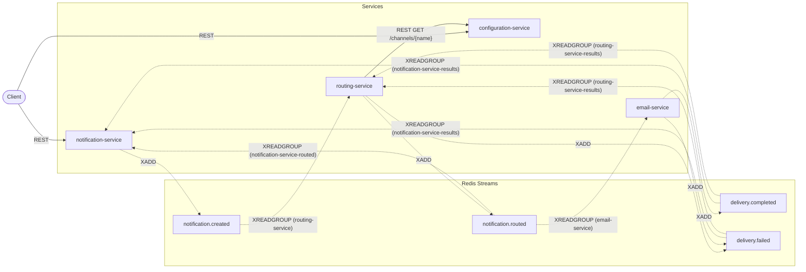

# Architecture

Slice 1 of the Universal Notification Platform: four services, one Redis instance, and one
Postgres database per service, wired together entirely through Redis Streams. This document
covers what slice 1 built. Telegram Service, the API Gateway, and recovery are slice 2 — see
"What slice 1 does not have" below.

## Services and boundaries

| Service | Owns | Database | HTTP surface |
|---|---|---|---|
| notification-service | The notification aggregate: what was requested, and its current status | `notificationdb` | `POST /notifications`, `GET /notifications/{id}`, `GET /notifications`, plus `/health`, `/version`, `/docs`, `/redoc` |
| routing-service | The routing decision per notification (`routes`) | `routingdb` | none — no domain endpoints, only `/health`, `/version`, `/docs`, `/redoc` |
| configuration-service | Channel enable/disable state (`channels`) | `configurationdb` | `GET /channels`, `GET /channels/{name}`, `PUT /channels/{name}`, plus `/health`, `/version`, `/docs`, `/redoc` |
| email-service | Email delivery attempts (`email_delivery`) | `emaildb` | none — no domain endpoints, only `/health`, `/version`, `/docs`, `/redoc` |

Routing Service and Email Service expose **no domain REST endpoints**. Their entire job runs in
background consumers reacting to events; a client never calls them directly, and there is no
`POST /route` or `POST /send` anywhere in slice 1 (see ADR 0021).

## Why choreography, not orchestration

No central coordinator holds the saga. Each service reacts to the facts it observes on Redis
Streams and publishes its own facts in turn: Notification Service does not tell Routing Service
what to do — it publishes `NotificationCreated` and Routing Service decides, unprompted, to react.
The same is true at every step through to `DeliveryCompleted`/`DeliveryFailed`.

The cost of choreography is that **the flow is not readable in one place**. There is no single
function or file that shows "and then this happens" for the whole saga — it is assembled, in the
reader's head, from four services' worth of independent consumer loops. This is exactly why
`docs/event-flows.md` exists: its three sequence diagrams are the one place the whole saga
*is* readable end to end, reconstructed from the choreography rather than expressed as code.

## Database per service

No service reads another service's database, and no service calls another service's REST API for
a domain operation (the one sanctioned exception is Routing Service's synchronous call to
Configuration Service, `GET /channels/{name}`). All cross-service domain interaction flows through
Redis Streams.

This has a direct, visible consequence: Email Service needs `recipient`, `subject`, and `body` to
actually deliver, but it cannot read Notification Service's database and cannot call it over REST.
So `NotificationRouted` forwards those delivery fields forward from `NotificationCreated`,
unchanged, through Routing Service — a deliberate exception to "events are small and focused,"
recorded in **ADR 0020**. The alternative was a forbidden cross-service read; forwarding the
payload was judged the lesser cost.

## Layering

Every service follows the same internal shape:

```
api  →  services  →  repositories
              ↕
           workers (consumers, outbox publisher)
```

Route handlers call the service layer only; the service layer calls repositories; **only
repositories contain SQLAlchemy queries** (`select`/`insert`/`update`). Background workers sit
alongside the service layer rather than under it — a consumer handler talks to repositories
directly, the same way a service does, because a consumer handler *is* the business logic for
that event, not a caller of it.

**One deliberate exception:** guarded status updates live in the repository as Core `update()`
statements rather than ORM load-mutate-save, because the transition guard
(`WHERE status IN (...)`) must be evaluated atomically by Postgres in the same statement as the
write — a read-then-write in Python has a window in which two consumer groups could race each
other. See **ADR 0016** and `docs/patterns.md`'s "Guarded monotonic transitions" section.

## What slice 1 does not have

- **No recovery worker and no watchdog.** `XPENDING`/`XCLAIM` recovery and the stale-processing
  watchdog are slice 2. A notification whose consumer crashes mid-flight — after `XREADGROUP`
  hands it a message but before the handler's transaction commits and `XACK`s — stays in its
  current state indefinitely. Nothing in slice 1 will ever revisit it.
- **No Telegram Service.** `telegram` is a valid `Channel` value and the `telegram-service`
  consumer group is declared on `notification.routed`, but nothing consumes it yet.
- **No API Gateway.** Clients talk to each service's own port directly (see the table in
  `docs/local-development.md` and the root `README.md`).

## Component diagram

REST edges are solid; stream edges are dashed. Configuration Service publishes no events — it is
read by Routing Service over REST only.


