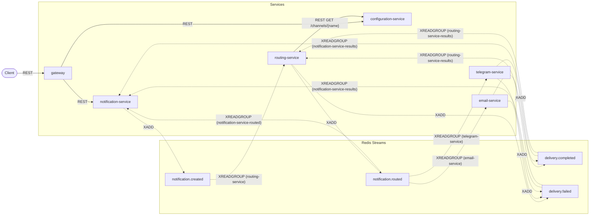

**English** | [Italiano](architecture.it.md)

# Architecture

Slice 2 of the Universal Notification Platform: six services, one Redis instance, and one Postgres
database per service except the Gateway, which owns none, wired together entirely through Redis
Streams. This document covers what slice 2 built, on top of slice 1's four services.

## Services and boundaries

| Service | Owns | Database | HTTP surface |
|---|---|---|---|
| notification-service | The notification aggregate: what was requested, and its current status | `notificationdb` | `POST /notifications`, `GET /notifications/{id}`, `GET /notifications`, plus `/health`, `/version`, `/docs`, `/redoc` |
| routing-service | The routing decision per notification (`routes`) | `routingdb` | none — no domain endpoints, only `/health`, `/version`, `/docs`, `/redoc` |
| configuration-service | Channel enable/disable state (`channels`) | `configurationdb` | `GET /channels`, `GET /channels/{name}`, `PUT /channels/{name}`, plus `/health`, `/version`, `/docs`, `/redoc` |
| email-service | Email delivery attempts (`email_delivery`) | `emaildb` | none — no domain endpoints, only `/health`, `/version`, `/docs`, `/redoc` |
| telegram-service | Telegram delivery attempts (`telegram_delivery`) | `telegramdb` | none — no domain endpoints, only `/health`, `/version`, `/docs`, `/redoc` |
| gateway | Nothing — a thin reverse proxy, no domain state | none | `/api/v1/*` proxy plus `/api/v1/health` (its own status only); `/docs`, `/redoc` |

Routing Service, Email Service, and Telegram Service expose **no domain REST endpoints**. Their
entire job runs in background consumers reacting to events; a client never calls them directly, and
there is no `POST /route` or `POST /send` anywhere in this platform (see ADR 0021). The Gateway's
route table (`gateway/README.md`) forwards only the endpoints notification-service and
configuration-service already expose — it does not add one.

## Why choreography, not orchestration

No central coordinator holds the saga. Each service reacts to the facts it observes on Redis
Streams and publishes its own facts in turn: Notification Service does not tell Routing Service
what to do — it publishes `NotificationCreated` and Routing Service decides, unprompted, to react.
The same is true at every step through to `DeliveryCompleted`/`DeliveryFailed`.

The cost of choreography is that **the flow is not readable in one place**. There is no single
function or file that shows "and then this happens" for the whole saga — it is assembled, in the
reader's head, from five services' worth of independent consumer loops. This is exactly why
`docs/event-flows.md` exists: its sequence diagrams are the one place the whole saga *is* readable
end to end, reconstructed from the choreography rather than expressed as code.

## Database per service

No service reads another service's database, and no service calls another service's REST API for
a domain operation (the one sanctioned exception is Routing Service's synchronous call to
Configuration Service, `GET /channels/{name}`). All cross-service domain interaction flows through
Redis Streams.

This has a direct, visible consequence: Email Service needs `recipient`, `subject`, and `body` to
actually deliver, but it cannot read Notification Service's database and cannot call it over REST.
So `NotificationRouted` forwards those delivery fields forward from `NotificationCreated`,
unchanged, through Routing Service — a deliberate exception to "events are small and focused,"
recorded in **ADR 0020**. The alternative was a forbidden cross-service read; forwarding the
payload was judged the lesser cost.

## Layering

Every service follows the same internal shape:

```
api  →  services  →  repositories
              ↕
           workers (consumers, outbox publisher)
```

Route handlers call the service layer only; the service layer calls repositories; **only
repositories contain SQLAlchemy queries** (`select`/`insert`/`update`). Background workers sit
alongside the service layer rather than under it — a consumer handler talks to repositories
directly, the same way a service does, because a consumer handler *is* the business logic for
that event, not a caller of it.

**One deliberate exception:** guarded status updates live in the repository as Core `update()`
statements rather than ORM load-mutate-save, because the transition guard
(`WHERE status IN (...)`) must be evaluated atomically by Postgres in the same statement as the
write — a read-then-write in Python has a window in which two consumer groups could race each
other. See **ADR 0016** and `docs/patterns.md`'s "Guarded monotonic transitions" section.

## Recovery and failure handling

**Recovery by idle claim.** Consumer names are container hostnames and change on every restart, so
a crashed consumer's pending stream entries cannot be found by re-reading its own name — they can
only be found by idle time and claimed regardless of owner. One `PendingRecoverer` per service
(`shared/notification_shared/recovery.py`) sweeps every registered `(stream, group, consumer)`,
calling the consumer's own `handle`. See ADR 0025.

**Max-retry give-up.** Only the recoverer counts failed attempts, in `processed_events.fail_count`.
After `PENDING_MAX_RETRIES` failed recovery attempts, the consumer's `give_up` writes its own
failure record and publishes a failure event — `RoutingFailed` from routing, `DeliveryFailed` from
email and telegram — so the notification reaches `FAILED` with reason `max_retries_exceeded`
instead of staying wherever the last attempt left it. See ADR 0024.

**The stale-processing watchdog.** `services/notification-service/app/workers/watchdog.py` closes
notifications stuck `PROCESSING` for longer than `PROCESSING_TIMEOUT_MINUTES`, with a guarded SQL
update and no published event — Routing Service's own `routes` row is untouched, and a delivery
result arriving later does not reopen the notification, because terminal states never reopen. See
ADR 0028.

## Still not built

An API key on the Gateway and Prometheus metrics are slice 3.

## Component diagram

REST edges are solid; stream edges are dashed. Configuration Service publishes no events — it is
read by Routing Service over REST only.


