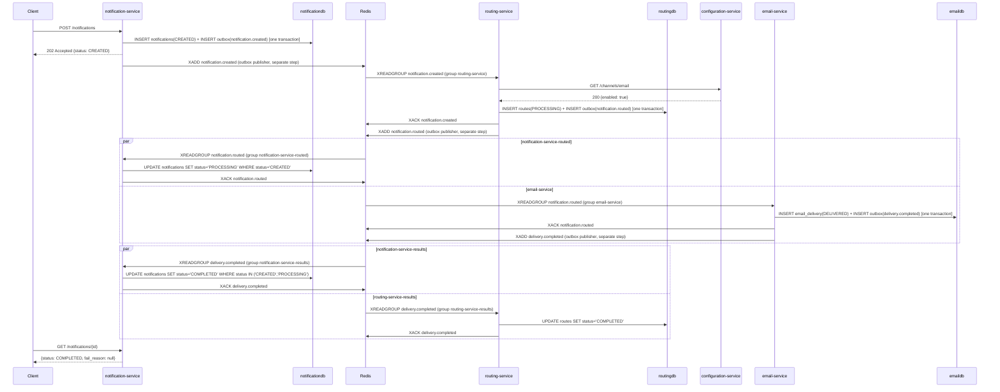
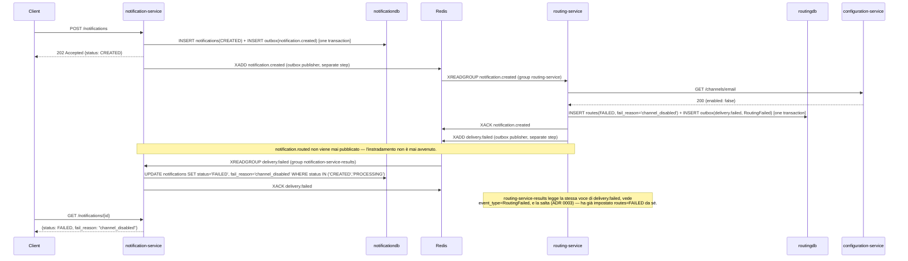
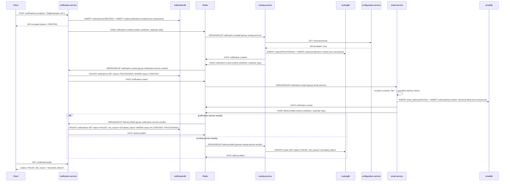
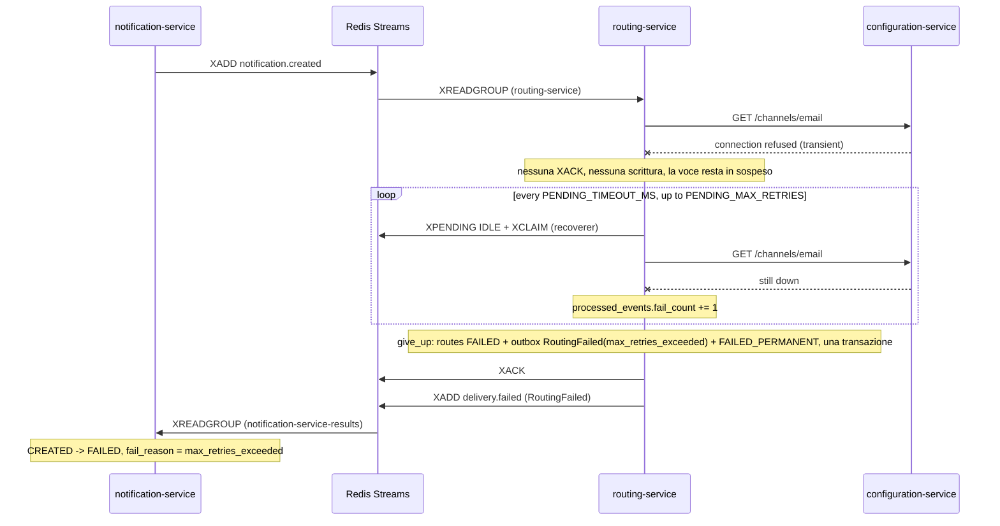

[English](event-flows.md) | **Italiano**

# Flussi di eventi

Ogni interazione di dominio che attraversa un confine tra servizi lo attraversa come evento su uno
stream Redis. Questo documento è l'unico punto in cui l'intera saga si legge dall'inizio alla fine
— il costo della coreografia (vedi `docs/architecture.md`) è che nessun singolo file nel sistema in
esecuzione la mostra; i diagrammi seguenti la ricostruiscono.

## L'envelope

Ogni evento è un `EventEnvelope` (`shared/notification_shared/events.py`):

```python
class EventEnvelope(BaseModel):
    event_id: UUID
    event_type: EventType
    event_version: int = 1
    occurred_at: datetime
    correlation_id: str
    aggregate_id: UUID    # always the notification_id
    payload: dict[str, Any]
```

| Campo | Scopo |
|---|---|
| `event_id` | Univoco per pubblicazione. La chiave di idempotenza, abbinata a un consumer group. |
| `event_type` | Uno dei cinque tipi di evento elencati di seguito. |
| `event_version` | Finora sempre `1`; riservato a futuri cambiamenti del payload. |
| `occurred_at` | Il momento in cui il fatto è diventato vero, non quello della pubblicazione. |
| `correlation_id` | Viene propagato dalla richiesta HTTP originaria attraverso ogni evento a valle, così ogni riga di log di ogni servizio per una stessa saga condivide lo stesso valore. |
| `aggregate_id` | **Sempre il notification_id** — mai un route id, un delivery id o altro — così l'intera saga, su ogni stream e ogni servizio, si correla su un unico identificatore indipendentemente dal servizio o dal tipo di evento coinvolto. |
| `payload` | Campi specifici dell'evento; vedi gli schemi di seguito. |

L'envelope viene serializzato in un **unico campo Redis chiamato `envelope`**, che contiene il
modello codificato in JSON (`EventEnvelope.to_redis()` / `.from_redis()`). Nessuna scomposizione su
più campi — vedi ADR 0019.

## Topologia degli stream

Tutti i gruppi vengono creati con `XGROUP CREATE <stream> <group> 0 MKSTREAM` all'interno del
`lifespan` FastAPI di ciascun servizio, prima che qualsiasi task di consumer parta (ADR 0002 —
offset `0`, mai `$`).

| Stream | Publisher | Consumer group | Comportamento |
|---|---|---|---|
| `notification.created` | notification-service | `routing-service` | Decide dove instradare la notifica |
| `notification.routed` | routing-service | `email-service` | Filtra `payload.channel == "email"`, consegna |
| | | `telegram-service` | Filtra `payload.channel == "telegram"`, consegna |
| | | `notification-service-routed` | Imposta `notifications.status = 'PROCESSING'` |
| `delivery.completed` | email-service, telegram-service | `notification-service-results` | Imposta `notifications.status = 'COMPLETED'` |
| | | `routing-service-results` | Imposta `routes.status = 'COMPLETED'` |
| `delivery.failed` | routing-service, email-service, telegram-service | `notification-service-results` | Imposta `notifications.status = 'FAILED'` + motivo |
| | | `routing-service-results` | Salta il proprio `RoutingFailed` (ADR 0003) |

## Tipi di evento e payload

`NotificationCreated` → `notification.created`

```json
{ "channel": "email", "recipient": "a@b.com", "subject": "Welcome", "body": "Hello" }
```

`NotificationRouted` → `notification.routed`

```json
{ "channel": "email", "recipient": "a@b.com", "subject": "Welcome", "body": "Hello",
  "route_id": "uuid" }
```

`RoutingFailed` → `delivery.failed`

```json
{ "channel": "email", "route_id": "uuid", "reason": "channel_disabled" }
```

`reason` è uno tra `channel_disabled`, `unknown_channel`, `max_retries_exceeded` (ADR 0024).

`DeliveryCompleted` → `delivery.completed`

```json
{ "channel": "email", "delivery_id": "uuid", "recipient": "a@b.com",
  "delivered_at": "2026-09-12T10:00:02Z" }
```

`recipient` è l'indirizzo email per `channel: "email"` e il chat id per `channel: "telegram"`
(ADR 0026).

`DeliveryFailed` → `delivery.failed`

```json
{ "channel": "email", "delivery_id": "uuid", "reason": "simulated_failure" }
```

`reason` è uno tra `simulated_failure`, `smtp_rejected`, `telegram_rejected`, `max_retries_exceeded`.

`subject` può essere nullo ovunque.

## Flussi della saga

Ogni diagramma mostra la scrittura nell'outbox e la `XADD` come **passi separati** — un publisher
in background sposta le righe dalla tabella `outbox` allo stream, con un proprio ciclo di polling,
dopo il commit della transazione di gestione. Unire i due passi in una sola freccia
nasconderebbe proprio il pattern che `docs/patterns.md` vuole insegnare: la scrittura che non deve mai
andare persa (la riga dell'outbox, dentro la transazione di dominio) non è la stessa operazione
della scrittura che rende l'evento visibile ai consumer (`XADD`, da una transazione successiva,
separata e non correlata).

### Caso di successo



### Canale disabilitato



### Consegna fallita



## Resa dopo il numero massimo di tentativi

Un'interruzione persistente — qui, Configuration Service irraggiungibile — lascia il messaggio in
sospeso dopo ogni tentativo ordinario. `PendingRecoverer` lo rivendica (claim) in base al tempo di
inattività e lo riprova da sé, contando ogni fallimento; al raggiungimento di `PENDING_MAX_RETRIES` chiama il
`give_up` del consumer invece di riprovare di nuovo.



`RS` qui rappresenta il `PendingRecoverer` in esecuzione dentro routing-service, che esegue lo
stesso `NotificationCreatedConsumer.handle` chiamato dal normale percorso di lettura
(`services/routing-service/app/workers/notification_consumer.py`); la coppia `XPENDING`/`XCLAIM` e
il ciclo dei tentativi appartengono a `shared/notification_shared/recovery.py`, non al codice
proprio di routing-service (ADR 0025). La resa (circa due minuti con i valori predefiniti) e il
watchdog (cinque minuti) sono dimostrati solo dai test di integrazione e di servizio — esercitarli
end-to-end renderebbe la suite e2e troppo lenta.

## La race condition sull'ordinamento e come la risolve la guardia SQL

`notification-service-routed` e `notification-service-results` sono consumer group indipendenti
che leggono stream diversi (rispettivamente `notification.routed` e
`delivery.completed`/`delivery.failed`) senza alcuna garanzia di ordinamento tra loro. La consegna
simulata delle email è abbastanza veloce perché `delivery.completed` possa davvero
essere consumato **prima** di `notification.routed` — la notifica è ancora `CREATED`
quando arriva l'evento di completamento.

Un handler senza condizione di guardia, che legge e poi scrive, lascerebbe che l'arrivo successivo del consumer
routed sovrascriva una notifica già `COMPLETED` riportandola a `PROCESSING`. La correzione 3.16
(ADR 0016) risolve il problema mettendo la condizione di guardia di ogni scrittura dello stato nella clausola
`WHERE` della `UPDATE`, invece che nel codice applicativo: la guardia del consumer dei risultati
ammette `status IN ('CREATED', 'PROCESSING')`, quindi `CREATED → COMPLETED` è legale proprio
perché questo completamento arrivato in anticipo venga registrato invece che scartato, mentre la
guardia del consumer routed ammette solo `status = 'CREATED'`, quindi la sua scrittura successiva e
ormai obsoleta contro una riga già `COMPLETED` non trova corrispondenze e non cambia nulla.
Entrambi gli handler eseguono `XACK` indipendentemente dal fatto che il loro update abbia trovato
una riga corrispondente — un arrivo fuori ordine resta comunque un evento gestito completamente,
non un errore.

`services/notification-service/tests/test_status_transitions.py::test_a_result_arriving_before_the_routed_event_is_not_overwritten`
pubblica entrambi gli eventi, consuma prima l'evento dei risultati fuori ordine, e verifica che la
notifica resti `COMPLETED` anche dopo che viene consumato l'evento routed arrivato in ritardo.
