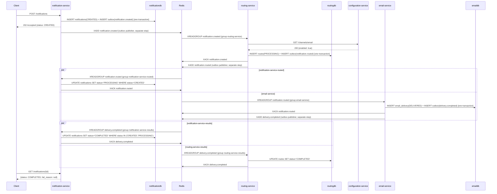
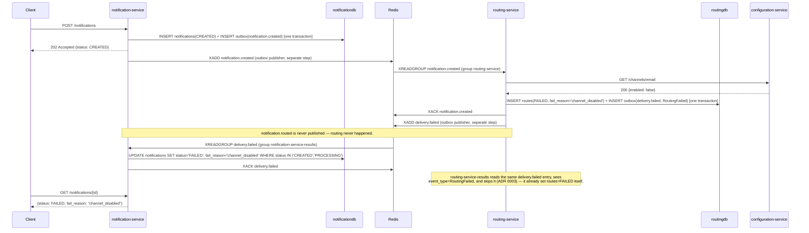
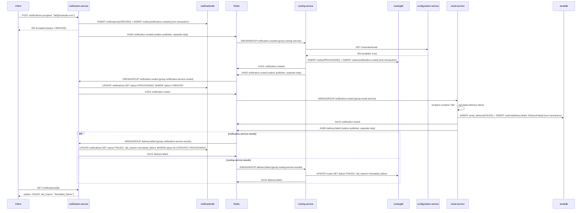

# Event Flows

Everything that crosses a service boundary in slice 1 crosses it as an event on a Redis Stream.
This document is the one place the whole saga is readable end to end — the cost of choreography
(see `docs/architecture.md`) is that no single file in the running system shows this; the diagrams
below reconstruct it.

## The envelope

Every event is an `EventEnvelope` (`shared/notification_shared/events.py`):

```python
class EventEnvelope(BaseModel):
    event_id: UUID
    event_type: EventType
    event_version: int = 1
    occurred_at: datetime
    correlation_id: str
    aggregate_id: UUID    # always the notification_id
    payload: dict[str, Any]
```

| Field | Purpose |
|---|---|
| `event_id` | Unique per publication. The idempotency key, paired with a consumer group. |
| `event_type` | One of the five event types below. |
| `event_version` | Always `1` in slice 1; reserved for future payload changes. |
| `occurred_at` | When the fact became true, not when it was published. |
| `correlation_id` | Carried from the originating HTTP request through every downstream event, so every log line across every service for one saga shares one value. |
| `aggregate_id` | **Always the notification_id** — never a route id, a delivery id, or anything else — so the whole saga, across every stream and every service, correlates on one identifier regardless of which service or event type is involved. |
| `payload` | Event-specific fields; see the schemas below. |

The envelope is serialized to a **single Redis field named `envelope`**, holding the JSON-encoded
model (`EventEnvelope.to_redis()` / `.from_redis()`). No multi-field flattening — see ADR 0019.

## Stream topology

All groups are created with `XGROUP CREATE <stream> <group> 0 MKSTREAM` inside each service's
FastAPI `lifespan`, before any consumer task starts (ADR 0002 — offset `0`, never `$`).

| Stream | Publishers | Consumer group | Behaviour |
|---|---|---|---|
| `notification.created` | notification-service | `routing-service` | Decides where the notification is routed |
| `notification.routed` | routing-service | `email-service` | Filters `payload.channel == "email"`, delivers |
| | | `telegram-service` | Declared, no consumer yet (slice 2); filters `"telegram"` |
| | | `notification-service-routed` | Sets `notifications.status = 'PROCESSING'` |
| `delivery.completed` | email-service | `notification-service-results` | Sets `notifications.status = 'COMPLETED'` |
| | | `routing-service-results` | Sets `routes.status = 'COMPLETED'` |
| `delivery.failed` | routing-service, email-service | `notification-service-results` | Sets `notifications.status = 'FAILED'` + reason |
| | | `routing-service-results` | Skips its own `RoutingFailed` (ADR 0003) |

## Event types and payloads

`NotificationCreated` → `notification.created`

```json
{ "channel": "email", "recipient": "a@b.com", "subject": "Welcome", "body": "Hello" }
```

`NotificationRouted` → `notification.routed`

```json
{ "channel": "email", "recipient": "a@b.com", "subject": "Welcome", "body": "Hello",
  "route_id": "uuid" }
```

`RoutingFailed` → `delivery.failed`

```json
{ "channel": "email", "route_id": "uuid", "reason": "channel_disabled" }
```

`reason` is one of `channel_disabled`, `unknown_channel`.

`DeliveryCompleted` → `delivery.completed`

```json
{ "channel": "email", "delivery_id": "uuid", "recipient": "a@b.com",
  "delivered_at": "2026-09-12T10:00:02Z" }
```

`DeliveryFailed` → `delivery.failed`

```json
{ "channel": "email", "delivery_id": "uuid", "reason": "simulated_failure" }
```

`subject` is nullable throughout.

## Saga flows

Each diagram shows the outbox write and the `XADD` as **separate steps** — a background publisher
moves rows from the `outbox` table to the stream, on its own poll loop, after the handling
transaction has already committed. Collapsing the two into one arrow would hide the pattern
`docs/patterns.md` exists to teach: the write that must never be lost (the outbox row, inside the
domain transaction) is not the same operation as the write that makes the event visible to
consumers (`XADD`, from a separate, unrelated transaction later).

### Happy path



### Channel disabled



### Delivery failure



## The ordering race, and how the SQL guard resolves it

`notification-service-routed` and `notification-service-results` are independent consumer groups
reading different streams (`notification.routed` and `delivery.completed`/`delivery.failed`
respectively) with no ordering guarantee between them. Email delivery is fast enough in slice 1
that `delivery.completed` can genuinely be consumed **before** `notification.routed` — the
notification is still `CREATED` when the completion event arrives.

An unguarded, read-then-write handler would let the routed consumer's later arrival overwrite a
finished `COMPLETED` notification back to `PROCESSING`. Correction 3.16 (ADR 0016) closes this by
guarding every status write in the `UPDATE`'s own `WHERE` clause rather than in application code:
the results consumer's guard admits `status IN ('CREATED', 'PROCESSING')`, so `CREATED → COMPLETED`
is legal specifically so that this early-arriving completion is recorded rather than dropped, while
the routed consumer's guard admits only `status = 'CREATED'`, so its later, stale write against an
already-`COMPLETED` row matches zero rows and changes nothing. Both handlers `XACK` regardless of
whether their update matched a row — an out-of-order arrival is still a fully handled event, not an
error.

`services/notification-service/tests/test_status_transitions.py::test_a_result_arriving_before_the_routed_event_is_not_overwritten`
publishes both events, consumes the results event first out of order, and asserts the notification
stays `COMPLETED` after the late routed event is also consumed.
