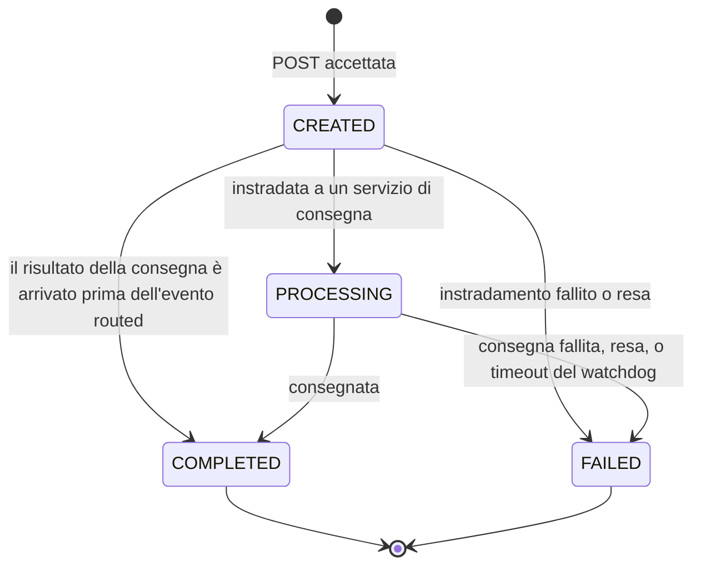

[English](api-reference.md) | **Italiano**

# Riferimento API

I client comunicano con il **Gateway** all'indirizzo `http://localhost:8000/api/v1`. Il Gateway
inoltra ogni chiamata invariata a notification-service o configuration-service e ne restituisce la
risposta invariata. I singoli servizi restano in ascolto anche sulle proprie porte per gli
healthcheck e per il debug.

## Convenzioni

- **Tipo di contenuto:** i corpi di richiesta e risposta sono in JSON (`Content-Type: application/json`).
- **Correlation id:** invia `X-Correlation-ID: <una stringa qualsiasi>` per etichettare una
  richiesta. Se lo ometti, il Gateway genera un UUID. Ogni risposta lo riporta, e
  ogni riga di log e ogni evento dell'intera saga di quella notifica lo porta con sé, così puoi
  seguire una richiesta attraverso tutti i servizi (vedi
  [Operatività](../operations.it.md#seguire-una-notifica)).
- **Swagger UI:** `http://localhost:8000/docs` (Gateway) e `/docs` / `/redoc` su ogni porta di
  servizio.
- **Nessuna autenticazione** in questa versione. È prevista una chiave API sul Gateway.

## Modello di errore

Ogni risposta di errore ha la stessa forma:

```json
{"error": {"code": "NOT_FOUND", "message": "notification '00000000-0000-0000-0000-000000000000' not found"}}
```

| HTTP | `code` | Quando |
|---|---|---|
| 404 | `NOT_FOUND` | Id di notifica o nome di canale sconosciuto |
| 422 | `VALIDATION_ERROR` | Corpo, percorso o parametro di query non validi; `message` elenca ogni problema |
| 502 | `BAD_GATEWAY` | Il Gateway non è riuscito a raggiungere il servizio in alcun modo |
| 504 | `GATEWAY_TIMEOUT` | Il servizio non ha risposto entro `GATEWAY_TIMEOUT_SECONDS` (predefinito 10) |

Il messaggio di un `422` è l'elenco degli errori di validazione reso come testo, ad esempio:

```json
{"error": {"code": "VALIDATION_ERROR", "message": "[{'type': 'enum', 'loc': ('body', 'channel'), 'msg': \"Input should be 'email' or 'telegram'\", ...}]"}}
```

## Notifiche

### `POST /api/v1/notifications` — invio

Corpo della richiesta:

| Campo | Tipo | Obbligatorio | Regole |
|---|---|---|---|
| `channel` | string | sì | `email` o `telegram` |
| `recipient` | string | sì | Da 1 a 255 caratteri. Un indirizzo email, oppure un chat id di Telegram |
| `subject` | string | no | Fino a 255 caratteri. Telegram lo antepone al messaggio |
| `body` | string | sì | Almeno 1 carattere |

```bash
curl -s -X POST http://localhost:8000/api/v1/notifications \
  -H 'Content-Type: application/json' -H 'X-Correlation-ID: doc-demo' \
  -d '{"channel": "email", "recipient": "john@example.com", "subject": "Welcome", "body": "Hello"}'
```

Risposta `202 Accepted`:

```json
{"notification_id": "f0dee1d5-2c10-405f-8fa5-731a8e082de4", "status": "CREATED"}
```

`202` significa *memorizzata e accodata*, non *consegnata*: interroga la notifica per conoscerne
l'esito.

### `GET /api/v1/notifications/{notification_id}` — lettura di una notifica

`notification_id` deve essere un UUID (altrimenti `422`). Risposta `200`:

```json
{
  "notification_id": "f0dee1d5-2c10-405f-8fa5-731a8e082de4",
  "channel": "email",
  "status": "COMPLETED",
  "fail_reason": null,
  "created_at": "2026-09-25T19:00:43.377935Z",
  "updated_at": "2026-09-25T19:00:45.704452Z"
}
```

Id sconosciuto: `404 NOT_FOUND`.

### `GET /api/v1/notifications` — elenco

Le più recenti per prime. Parametri di query:

| Parametro | Predefinito | Regole |
|---|---|---|
| `limit` | 20 | 1–100 |
| `offset` | 0 | 0 o superiore |
| `status` | — | `CREATED`, `PROCESSING`, `COMPLETED` o `FAILED` |
| `channel` | — | `email` o `telegram` |

```bash
curl -s "http://localhost:8000/api/v1/notifications?status=FAILED&limit=5"
```

Risposta `200`: un array JSON degli stessi oggetti restituiti da `GET /notifications/{id}`.

### Ciclo di vita dello stato



`COMPLETED` e `FAILED` sono stati finali: niente li modifica più.
`CREATED → COMPLETED` è una transizione lecita perché i due eventi viaggiano su stream indipendenti
([ADR 0016](../adr/0016-status-transitions-guarded-in-sql.md)).

### Valori di `fail_reason`

| `fail_reason` | Impostato da | Significato |
|---|---|---|
| `channel_disabled` | routing-service | Il canale era disattivato al momento dell'instradamento della notifica |
| `unknown_channel` | routing-service | Configuration Service non conosce il canale |
| `simulated_failure` | email/telegram-service | Il destinatario contiene `fail` (fallimento di test deterministico) |
| `smtp_rejected` | email-service | Il server SMTP ha rifiutato in modo permanente il messaggio (5xx) |
| `telegram_rejected` | telegram-service | La Bot API ha rifiutato la chat o il messaggio (400/403) |
| `max_retries_exceeded` | routing/email/telegram-service | Un fallimento transitorio si è ripetuto a ogni tentativo |
| `processing_timeout` | watchdog di notification-service | Bloccata in `PROCESSING` più a lungo di `PROCESSING_TIMEOUT_MINUTES` |

## Canali

### `GET /api/v1/channels`

```json
[{"name": "email", "enabled": true}, {"name": "telegram", "enabled": true}]
```

### `PUT /api/v1/channels/{name}` — attivare o disattivare un canale

```bash
curl -s -X PUT http://localhost:8000/api/v1/channels/email \
  -H 'Content-Type: application/json' -d '{"enabled": false}'
```

Risposta `200`: `{"name": "email", "enabled": false}`. Canale sconosciuto: `404 NOT_FOUND`. La
modifica si applica alla prossima decisione di instradamento; le notifiche già instradate non ne
sono influenzate.

## Salute e versione

| Endpoint | Risposta |
|---|---|
| `GET :8000/api/v1/health` | `{"status": "UP", "service": "gateway"}` — solo lo stato del Gateway stesso |
| `GET :800x/health` | `{"status": "UP", "service": "...", "checks": {"database": "UP", "redis": "UP"}}`; `503` con `"DOWN"` quando una dipendenza è ferma. configuration-service controlla solo il proprio database |
| `GET :800x/version` | `{"service": "...", "version": "1.0.0"}`; email e telegram restituiscono anche `"delivery_mode"`: `simulated`, `smtp` o `bot_api` |

Il Gateway non aggrega lo stato di salute dei servizi: interroga la porta di ciascun servizio.

## Accesso diretto ai servizi

Per il debug puoi chiamare un servizio senza passare dal Gateway, sulla sua porta e senza il
prefisso `/api/v1` — ad esempio `http://localhost:8001/notifications` o
`http://localhost:8003/channels`. routing-service, email-service e telegram-service espongono solo
`/health`, `/version`, `/docs` e `/redoc`: il loro lavoro avviene interamente in consumer in
background.
