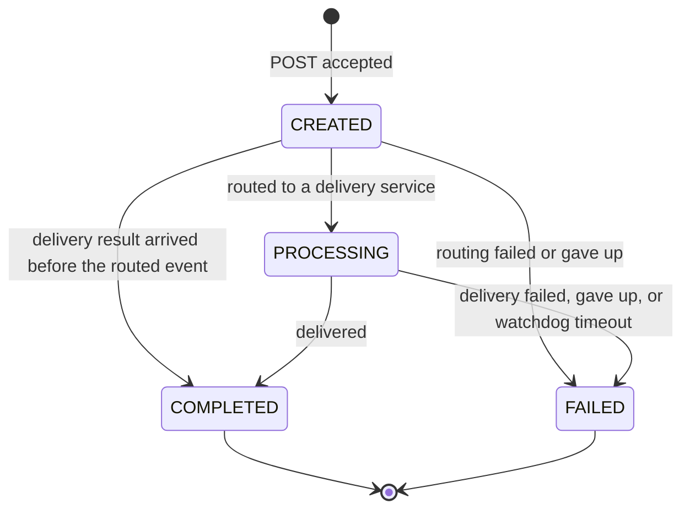

**English** | [Italiano](api-reference.it.md)

# API reference

Clients talk to the **Gateway** at `http://localhost:8000/api/v1`. The Gateway forwards each call
unchanged to notification-service or configuration-service and returns their response unchanged.
Individual services also listen on their own ports for health checks and debugging.

## Conventions

- **Content type:** request and response bodies are JSON (`Content-Type: application/json`).
- **Correlation id:** send `X-Correlation-ID: <any string>` to tag a request. If you omit it, the
  Gateway generates a UUID. Every response echoes it, and every log line and event of that
  notification's whole saga carries it, so you can trace one request across all services (see
  [Operations](../operations.md#trace-one-notification)).
- **Swagger UI:** `http://localhost:8000/docs` (Gateway) and `/docs` / `/redoc` on every service
  port.
- **No authentication** in this version. An API key on the Gateway is planned.

## Error model

Every error response has the same shape:

```json
{"error": {"code": "NOT_FOUND", "message": "notification '00000000-0000-0000-0000-000000000000' not found"}}
```

| HTTP | `code` | When |
|---|---|---|
| 404 | `NOT_FOUND` | Unknown notification id or channel name |
| 422 | `VALIDATION_ERROR` | Invalid body, path or query parameter; `message` lists every problem |
| 502 | `BAD_GATEWAY` | The Gateway could not reach the service at all |
| 504 | `GATEWAY_TIMEOUT` | The service did not answer within `GATEWAY_TIMEOUT_SECONDS` (default 10) |

A `422` message is the list of validation errors rendered as text, for example:

```json
{"error": {"code": "VALIDATION_ERROR", "message": "[{'type': 'enum', 'loc': ('body', 'channel'), 'msg': \"Input should be 'email' or 'telegram'\", ...}]"}}
```

## Notifications

### `POST /api/v1/notifications` — submit

Request body:

| Field | Type | Required | Rules |
|---|---|---|---|
| `channel` | string | yes | `email` or `telegram` |
| `recipient` | string | yes | 1–255 characters. An email address, or a Telegram chat id |
| `subject` | string | no | Up to 255 characters. Telegram prepends it to the message |
| `body` | string | yes | At least 1 character |

```bash
curl -s -X POST http://localhost:8000/api/v1/notifications \
  -H 'Content-Type: application/json' -H 'X-Correlation-ID: doc-demo' \
  -d '{"channel": "email", "recipient": "john@example.com", "subject": "Welcome", "body": "Hello"}'
```

Response `202 Accepted`:

```json
{"notification_id": "f0dee1d5-2c10-405f-8fa5-731a8e082de4", "status": "CREATED"}
```

`202` means *stored and queued*, not *delivered*: poll the notification to learn the outcome.

### `GET /api/v1/notifications/{notification_id}` — read one

`notification_id` must be a UUID (`422` otherwise). Response `200`:

```json
{
  "notification_id": "f0dee1d5-2c10-405f-8fa5-731a8e082de4",
  "channel": "email",
  "status": "COMPLETED",
  "fail_reason": null,
  "created_at": "2026-09-25T19:00:43.377935Z",
  "updated_at": "2026-09-25T19:00:45.704452Z"
}
```

Unknown id: `404 NOT_FOUND`.

### `GET /api/v1/notifications` — list

Newest first. Query parameters:

| Parameter | Default | Rules |
|---|---|---|
| `limit` | 20 | 1–100 |
| `offset` | 0 | 0 or more |
| `status` | — | `CREATED`, `PROCESSING`, `COMPLETED` or `FAILED` |
| `channel` | — | `email` or `telegram` |

```bash
curl -s "http://localhost:8000/api/v1/notifications?status=FAILED&limit=5"
```

Response `200`: a JSON array of the same objects `GET /notifications/{id}` returns.

### Status lifecycle



`COMPLETED` and `FAILED` are final: nothing ever changes them again.
`CREATED → COMPLETED` is legal because the two events travel on independent streams
([ADR 0016](../adr/0016-status-transitions-guarded-in-sql.md)).

### `fail_reason` values

| `fail_reason` | Set by | Meaning |
|---|---|---|
| `channel_disabled` | routing-service | The channel was switched off when the notification was routed |
| `unknown_channel` | routing-service | Configuration Service does not know the channel |
| `simulated_failure` | email/telegram-service | The recipient contains `fail` (deterministic test failure) |
| `smtp_rejected` | email-service | The SMTP server permanently refused the message (5xx) |
| `telegram_rejected` | telegram-service | The Bot API refused the chat or message (400/403) |
| `max_retries_exceeded` | routing/email/telegram-service | A transient failure persisted through every retry |
| `processing_timeout` | notification-service watchdog | Stuck in `PROCESSING` longer than `PROCESSING_TIMEOUT_MINUTES` |

## Channels

### `GET /api/v1/channels`

```json
[{"name": "email", "enabled": true}, {"name": "telegram", "enabled": true}]
```

### `PUT /api/v1/channels/{name}` — switch a channel on or off

```bash
curl -s -X PUT http://localhost:8000/api/v1/channels/email \
  -H 'Content-Type: application/json' -d '{"enabled": false}'
```

Response `200`: `{"name": "email", "enabled": false}`. Unknown channel: `404 NOT_FOUND`. The change
applies to the next routing decision; notifications already routed are not affected.

## Health and version

| Endpoint | Response |
|---|---|
| `GET :8000/api/v1/health` | `{"status": "UP", "service": "gateway"}` — the Gateway's own status only |
| `GET :800x/health` | `{"status": "UP", "service": "...", "checks": {"database": "UP", "redis": "UP"}}`; `503` with `"DOWN"` when a dependency is down. configuration-service checks only its database |
| `GET :800x/version` | `{"service": "...", "version": "1.0.0"}`; email and telegram also return `"delivery_mode"`: `simulated`, `smtp` or `bot_api` |

The Gateway does not aggregate service health: query each service port.

## Direct service access

For debugging you can call a service without the Gateway, at its own port and without the
`/api/v1` prefix — for example `http://localhost:8001/notifications` or
`http://localhost:8003/channels`. routing-service, email-service and telegram-service expose only
`/health`, `/version`, `/docs` and `/redoc`: their work happens entirely in background consumers.
